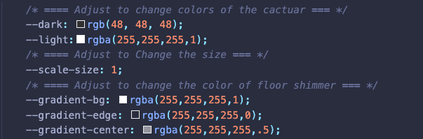

# Cactuar Animated CSS Loading Placeholder

[Live Page](https://rojorevolution.github.io/cactuar-animation/)

Created this animation as a loading placeholder for a different project that utilizes APIs. Thought it was pretty neat though, and wanted to share. 

Built with HTML and CSS only. The CSS was set up to easily allow the changing of all colors, and to also scale the size with simple variable changes.

